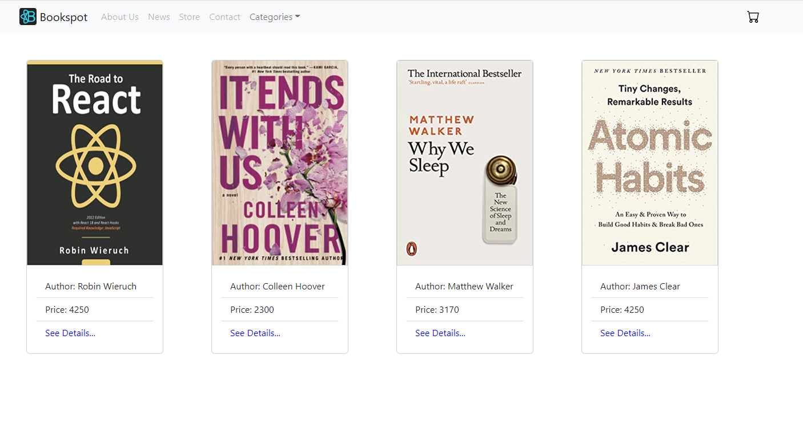
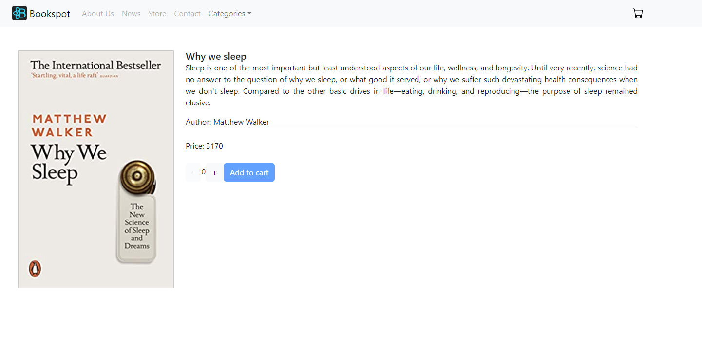
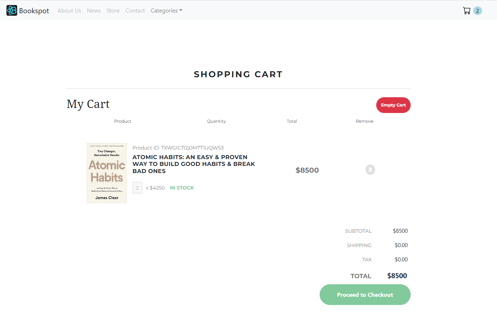
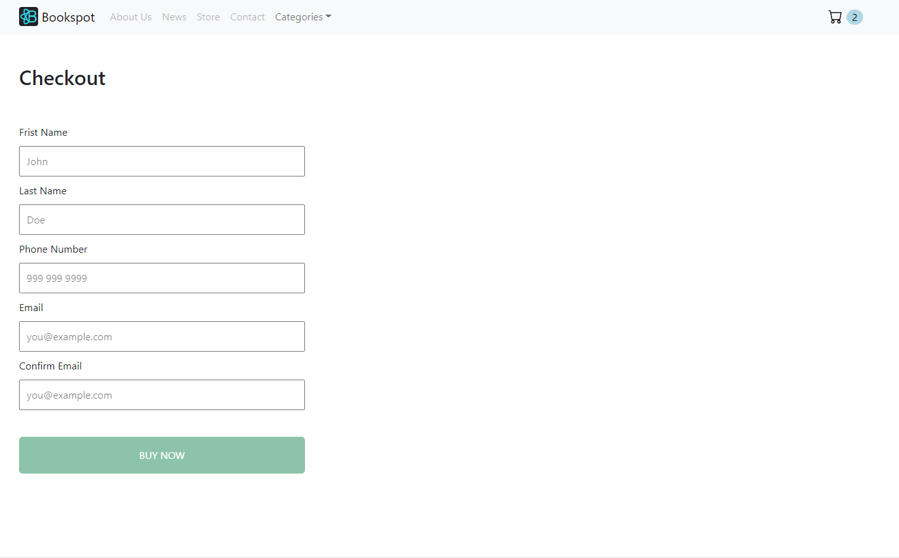
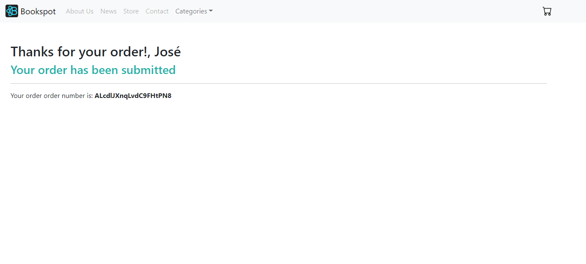

<br />
<div align="center">
  <a href="https://github.com/tatozan/react-js-proyecto-final">
    
  </a>
  <h3 align="center">E-Commerce-React-App</h3>

  <p align="center">
     E-commerce con las operaciones básicas y típicas de estos sitios, por normbrar algunas: visualización de productos, navegación por categorías, posibilidad de llenar un carro de compras, etc.
    <br />
    <br />
    <a href="https://ecommerce-react-zanolli.netlify.app/">Ver sitio</a>
  </p>
</div>
<br />
<br />
<br />


# Tabla de contenidos
- [Acerca del Proyecto](#acerca-del-proyecto)
- [Estructura del Proyecto](#estructura-del-proyecto)
  * [Página de inicio o Home](#inicio-o-home)
  * [Página detalle del producto](#página-detalle-del-producto)
  * [Página carrito de compras](#página-carrito-de-compras)
  * [Página de checkout](#página-de-checkout)
  * [Página de compra exitosa](#página-de-compra-exitosa)
- [Tecnologías aplicadas](#tecnologías-aplicadas)
- [Comenzando](#comenzando)
  * [Pre-requisitos](#pre-requisitos)
  * [Instalación](#instalación)
  * [Ejecución](#ejecutando-la-aplicación)
- [Autor](#autor) 
- [Licencia](#licencia) 
- [Mostranos tu apoyo](#mostranos-tu-apoyo) 

<br />
<br />


## Acerca del Proyecto
Este proyecto surge como trabajo final de la carrera de desarrollo Fontend. En este caso se trata de un sitio web, puntualmente un e-commerce de libros, realizado en React, integrado con Firebase & Firestone y estilado con Bootstarp. De fácil navegación, con una interfaz simple y concisa, este proyecto posibilita que el usuario se abra paso a través de los diferentes ítems exhibidos para la venta, los cuales puede visualizar, de forma individual, en sus respectivas vistas, ampliando así la información presentada. Asimismo el usuario puede ir haciéndose de su carrito de compras, agregando los productos que desee con sus cantidades correspondientes, pudiendo visualizar toda esa informaicón es una única vista, con el total de la operación para finalmente poder terminar el proceso de compra, previo al llenado de un formulario.  
<br/>

En relación a los ítems exhibidos en este proyecto, decir que los mismos se encuentran alojados en la nube, haciendo uso del servicio de Firebase & Firestone, al igual que las categorías exhibidas, las cuales se generan de forma totalmente dinámica, lo que posibilita que el proyecto sea escalable y de fácil administración. 
<br/>
<br/>

## Estructura del Proyecto.

### Inicio o Home
Esta es la primera página a la que el usuario accede cuando ingresa al sitio. La misma muestra un listado de todos los productos disponibles. En la parte superior se encuentra el menú y dentro de éste, en el costado derecho, se ubica un desplegable, de nombre: "Categories", con las diferentes categorías de productos.  
<br/>



### Página detalle del producto
Muestra el detalle del producto que ha sido seleccionado previamente por el usuario, ya sea desde el Home o desde alguna de las categorías. A través de esta vista el usuario accede a una información más detallada del producto, como puede ser: nombre, descripción, precio, etc. A su vez posibilita que el usuario pueda agregar el ítem al carrito de compras, seleccionando la cantidad deseada y luego clickeando el botón correspondiente. <br/><br/>**NOTA IMPORTANTE: Si el producto visualizado por el usuario hubiera sido previamente agregado al carrito, en el apartado de cantidad de esta vista se va a mostrar la última cantidad selectada, pudiendo la misma ser modificada.**
<br/>




### Página carrito de compras
Muestra la información del producto o productos que el usuario ha añadido para la compra, junto con su cantidad, subtotal y total correspondiente. En caso de desearlo, el usuario puede remover los ítems que desee de forma individual (botón en forma de equis (x) que aparece junto a cada producto), o remover la totalidad de los mismos mediante el botón rojo que aparece en la parte superior derecha. Por último, y para seguir con el proceso de compra, en la parte inferior derecha se exhibe el botón que lleva al checkout.
<br/>
<br/>



### Página de checkout
Muestra el formulario que ha de completarse para finalizar el proceso de compra. Todos los campos son necesarios.

<br/>




### Página de compra exitosa
Muestra la confirmación de la compra realizada por el usuario. Además, provee al usuario con un número de orden de compra único.




# Tecnologías aplicadas
Para la construcción de este proyecto se utilizaron múltiples conceptos, en conjunto con una vasta cantidad de librerías. Por nombrar algunas:

* [React.js](https://reactjs.org/): _Se utilizó para la creación de la estructura principal del proyecto._
* [React Spinners](https://www.npmjs.com/package/react-spinners): _Se utilizó para mostrar el estado de carga de algunos componentes y mejorar así la experiencia del usuario al dar una señal de carga._
* [React Router DOM](https://www.npmjs.com/package/react-router-dom): _Se implementó para la navegación de las diferentes secciones._
* [React Bootstrap](https://react-bootstrap.github.io/): _Se utilizó para facilitar el armado de la interfaz, haciendo uso de los componentes que provee._
* [Firebase - Firestore](https://firebase.google.com/): _Base de datos no relacional alojada en la nube que se utilizó para el manejo de Datos a través de diferentes colecciones que se implementaron._
* [Sweet Alert](https://sweetalert2.github.io/): _Se utilizó para darle al usuario notificaciones de un modo amigable y visual._
* **React Hooks**: _Se implementaron para el manejo de estados, entre otras cosas._
* **Custom Hooks**: _Se implementó para abstraer parte de la lógica y para un mejor control de la información del formulario._
* **Context**: _Se utilizó para el manejo de la lógica del carro y para poder pasar esa información entre componentes, sin tener que pasarlo por props._
* **Forms**: _Se manipuló data a través de un form en React._
* **Expresiones Regulares**: _Se implementaron para la validación de los datos ingresados por el usaurio._
* **GIT**: _Indispensable para la prueba y testeo de nuevas funcionalidades._
* **CSS**: _Se utilizó para darle estilo propio a algunos componentes._
* **Environmental variables**: _Se utilizaron para proteger información sensible._

<br />


# Comenzando

Seguí estos pasos que te van a dejar con el proyecto _"up & running"_ en tu computadora, ya sea para desarrollo y/o fines de prueba.


### Pre-requisitos

Es necesario tener instalado el siguiente software en tu sistema operativo:

* Node
* npm 

Podés utilizar los siguientes comandos para verificar tus versiones de Node y npm:

```bash
node -v
npm -v
```


### Instalación
Primero vas a necesitar descargar y/o clonar el repositorio, para ello, seguí los pasos que se detallan a continuación:

* Clone _'https://github.com/tatozan/react-js-proyecto-final.git'_ repository from GitHub

  ```bash
  git clone https://github.com/tatozan/react-js-proyecto-final.git
  ```

   _O USANDO SSH_

  ```bash
  git clone git@github.com:tatozan/react-js-proyecto-final.git
  ```

* Instalar las dependencias<br/>
En la carpeta del proyecto, ejecutá el siguiente comando para instalar las dependencias necesarias.

   ```bash
   npm install
   ```


### Ejecutando la aplicación

* Por último, ejecutá la aplicación con este comando:

  ```bash
  npm start
  ```


<br />


# Autor

👤 **Esteban Zanolli**

- Github: [@tatozan](https://github.com/tatozan/)
- Instagram: [@tatozan](https://instagram.com/tatozan)
- Podés escribirme a: tatozan@gmail.com

<br />


# Licencia

Distribuído bajo la licencia MIT. Para más info, ingresá en [MIT LICENCE](https://opensource.org/licenses/MIT) 

<br />


# Mostranos tu apoyo

Por favor, si te gustó el proyecto y te fue útil, no dejés de compartirlo. Por otro lado, si tenés algún tipo de sugerencia o recomendación que pueda hacer de ésto algo mejor, no dejés de hacérmela llegar, contactame a través de alguna de mis redes.</br>

No te olvides de darle una ⭐️ al proyecto. Gracias de nuevo!<br/></br>
**Próximamente** </br><br/>
</br>


<br />

---

_Este archivo README fue generado con ❤️_ 